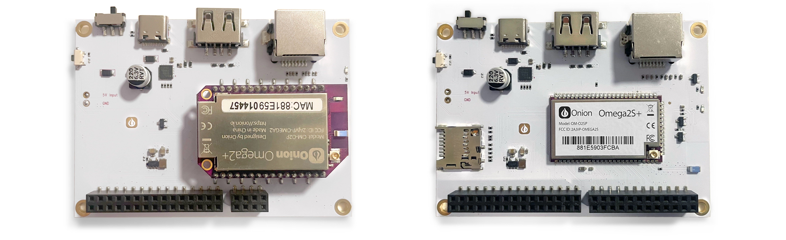

# Omega2-Eval-Boards
Onion Omega2 Eval Boards - Two boards designed for developing and prototyping with the Omega2 module ecosystem

## Where to Buy

See https://onion.io/buy/?p=OM-O2SP-EVAL for information on where to buy the Omega2 Eval Boards

## Getting Started

Get your Omega2 Eval Board up and running by following the [Quickstart Guide](https://documentation.onioniot.com/quickstart/intro). 

Prefer visual instructions? Our Quickstart Guide features a video that covers all the steps with clear visuals and explanations.

## Hardware

Schematics and layout images are available for the Omega2 Eval Boardare in the [Hardware](./Hardware) directory.

## Images

The [Images](./Images) directory holds official photos of the Omega2 Eval Board.

<!-- ## Pin-Outs

TODO: add pinout images and link here -->

